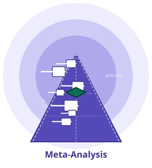

# meta-analysis

- **English guide** → [README.md](https://github.com/medstatstar/meta-analysis/blob/main/README.md) · **中文指南** → [README_zh-CN.md](https://github.com/medstatstar/meta-analysis/blob/main/README_zh-CN.md)

  

> **No install needed for the basics:** if you don't want to install this skill and just want to try its core features quickly, use the web app directly at **https://meta.medstatstar.com**.

> **Easy-to-use R-based Meta-Analysis for Clinical Researchers**
>
> You don't need to code or memorize commands — just describe your meta-analysis needs in **plain language inside a chat**, and the skill **automatically runs** the full analysis (pooling, figures, report) for you. Powered by R and 14 core + 2 optional professional R packages (metafor, meta, netmeta, bayesmeta, dosresmeta, mada, etc.), it returns results in Chinese or English depending on your OS language setting (you can force-switch via a prompt at any time). Once you describe a request, the skill **auto-executes** and returns results + figures; ask for the full reproducible R code at any time.

---

## Who This Is For

meta-analysis is part of the CT-series skill family, built for three groups:

- **Clinical-trial practitioners at pharmaceutical companies** — sponsors, CROs, and medical / statistical / regulatory roles who need to pool and compare study evidence;
- **Clinicians and nurses who design, conduct, or participate in clinical research** and need meta-analysis / systematic-review support;
- **Medical students who want to learn evidence-based medicine and meta-analysis methodology in a structured way**.

---

## 1. How to Use It in a Chat (the Core)

meta-analysis is a **conversational skill**: you simply tell the assistant what you want in natural language — no commands, no parameter names to remember. As a WorkBuddy skill it **auto-loads with no extra installation**.

Below are 7 real conversational examples — **one per category** in the Scenario Index (§2): ① systematic-review workflow, ② pairwise meta, ③ heterogeneity & bias, ④ advanced models, ⑤ effect-size conversion, ⑥ visualization, ⑦ study quality. Each shows **"You say"** and a sketch of **"The assistant replies"**, plus how to get the actual number.

### Example 1 · ① Systematic review workflow: topic selection
**You say:**
> I'm interested in SGLT2 inhibitors for renoprotection and cardiovascular benefit in chronic kidney disease (CKD), but I haven't decided which specific meta-analysis direction to pursue. Can you help me shortlist candidate directions?

**Assistant replies (sketch):**
> Sure — I'll use a **topic-selection approach** to lock down the direction. First I run the **in-skill dedup probe (Cochrane + PubMed real hit counts)**, then shortlist — otherwise a saturated direction can be wrongly pushed as top pick.
>
> **First, rule out the saturated directions**: the generic "SGLT2i on cardiorenal outcomes in CKD" is Cochrane 23 / PubMed 2785 — highly saturated. **Counter-intuitively**, the seemingly niche **non-diabetic CKD (Cochrane 20 / PubMed 2402)** and **dialysis / advanced CKD (Cochrane 22 / PubMed 1067)** are also heavily covered (DAPA-CKD / EMPA-KIDNEY spawned many reviews) — also not recommended.
>
> Re-shortlisting 3 candidates by **evidence gap + novelty** (I'll produce 1–3 directions; I won't decide for you):
>
> **Candidate ① Renoprotection in IgA nephropathy (top pick)**
> - Cochrane 4 / PubMed 224 (≈1/10 of the broad direction) → **real gap**
> - Most common primary GN; SGLT2i already a guideline adjunct; many RCTs, data available
>
> **Candidate ② Net benefit / benefit–risk framework**
> - Cochrane 5 / PubMed 442 → gap
> - Pools renal + cardiac benefit with safety events (DKA / infection / volume depletion) in one framework — strong methodological differentiation
>
> **Candidate ③ Specific glomerular diseases (FSGS / membranous / ADPKD / lupus)**
> - FSGS Cochrane 0, ADPKD 2, membranous 1, lupus 3 → **very deep gap**
> - ⚠️ but sparse RCTs → power risk; better as a **scoping review** than a hard efficacy MA
>
> **Suggestion**: Start with ① (real gap, high clinical need); ② as the methodological-differentiation alternative; ③ conditional. Next step: a **full topic assessment** (PICO + dedup search + PRISMA/AMSTAR-2 pre-check), and **run ct-literature first for a full dedup confirmation** (the probe is a quick signal; FSGS=0 may include index-phrasing variance, don't rely on it alone).

**📌 Note:** When you have a direction but are unsure which specific meta to run, the assistant uses the topic-selection framework to produce **1–3 candidate directions + a 4-dim score + meta type**, instead of deciding for you or giving a single answer. This is the **topic-selection gate** before analysis — no R computation is invoked. Candidates are stratified by **evidence gap / novelty**, each backed by the **in-skill dedup probe (Cochrane + PubMed real hit counts)** — so a saturated generic direction (including the "intuitively niche" non-diabetic CKD or dialysis) is no longer mis-pushed as the top pick.

### Example 2 · ② Pairwise meta: two-group binary (most common)
**You say:**
> Combine the OR across these 5 binary studies:
> Study A: experimental 30/100, control 20/100
> Study B: experimental 45/120, control 30/100
> ...

**Assistant replies (sketch):**
> ✅ 5 studies, random-effects (DL), OR = 1.52 (95%CI: 1.18–1.96), I² = 34%
> (Ask for the full reproducible R code at any time.)

**📌 Auto-execution:** Once you describe the request, the assistant **auto-executes** and returns the real result; ask for the reproducible code by saying **"give me the full R code"**.

### Example 3 · ③ Heterogeneity & bias: I² + subgroup
**You say:**
> I did a continuous meta with 8 studies, SMD pooled, but I² is high — I want to subgroup by region

**Assistant replies (sketch):**
> ✅ 8 studies, SMD = 0.42 (95%CI: 0.15–0.69), I² = 78%
> Subgroup by region:
> - Asia (k=4): SMD = 0.55, I² = 45%
> - Euro-US (k=4): SMD = 0.28, I² = 62%
> - Between-group Q = 4.12, p = 0.04

### Example 4 · ④ Advanced models: network meta with multiple decisions
**You say:**
> I want to do a network meta with 4 interventions, but I haven't decided whether to use frequentist or Bayesian, and I'm not sure if I should include dose-response

**Assistant replies (sketch):**
> 4 interventions clear. Two key choices to clarify:
>
> **① Which analysis framework?**
> - (a) Frequentist — `netmeta`, inverse-variance based, good for consistent networks
> - (b) Bayesian — `gemtc` (JAGS) or `multinma` (Stan) **local only** (a known coze limitation: the container has no root to install JAGS; on the cloud use (a) netmeta); `bayesmeta` supports Bayesian pairwise comparisons locally
>
> **② Include dose-response?**
> - (a) No — pure pairwise comparison network
> - (b) Yes — needs dose-effect parameters, Bayesian framework preferred
>
> **③ Can't decide?** → say "explain the differences between these choices in detail", and I'll clarify the clinical/statistical meaning before you choose

**📌 Note:** When you've **named the test type but are stuck on "which option / design family"**, the assistant **pops a routing menu** to confirm step by step — instead of deciding for you or dumping the full menu. The menu also offers an "explain the differences" option — when you're unsure, it explains before you decide.

### Example 5 · ⑤ Effect size conversion
**You say:**
> Convert Cohen's d = 0.8 to logOR

**Assistant replies (sketch):**
> ✅ d = 0.8 → logOR ≈ 1.45 (SE ≈ 0.38), based on logOR = d × π/√3

### Example 6 · ⑥ Visualization
**You say:**
> Draw a forest plot, lancet theme

**Assistant replies (sketch):**
> ✅ Forest plot generated (lancet theme, with summary diamond and I² label). [SVG output]

### Example 7 · ⑦ Study quality
**You say:**
> Assess risk of bias with RoB 2.0

**Assistant replies (sketch):**
> ✅ RoB 2.0 assessment complete. Please provide the risk-of-bias judgment (Low / Some concerns / High) for each study — I'll generate the traffic-light plot and stacked summary bar. [SVG output]

---

## 2. What You Can Do — Scenario Index

Categories are grouped by **workflow stage first, then analysis purpose** (7 below). The systematic-review workflow comes first as the upstream gate, followed by six analysis-purpose categories. Each row gives the typical **clinical scenario** and a line you can **copy verbatim** under "Try saying". The same test may be reached from multiple entry points.

> The underlying R packages (metafor / meta / netmeta …) are listed in Section 6 "Advanced Reference"; ordinary users don't need to care.

### ① Systematic Review Workflow
| Scenario | Try saying in chat |
|:---|:---|
| Topic feasibility check | "Judge my topic: efficacy of ×××" (real literature hit counts + 4-dim score verdict) |
| Full topic report | "Produce the full topic-assessment report" (PICO → scoring → dedup → compliance pre-check → 11-section report) |
| Literature retrieval | "Run a systematic search on this topic" (multi-source + dedup + Excel/HTML, delegated to ct-literature) |
| Title/abstract screening | "Screen the search results" (machine pre-screen + per-record human verdict, PRISMA counts bridged) |
| PRISMA flow | "Help me generate a PRISMA flow diagram" |
| PRISMA checklist | "Generate the PRISMA 2020 checklist (27 items)" |
| Data-extraction assistant | "Give me an extraction sheet to fill from the papers" (blank sheet → LLM draft → **line-by-line human verification** → stamp to release) |
| Quality gate | "Run the quality gate" (k count / I² / missing bias check — red cards block presentation) |
| Overclaim check | "Check whether the conclusions overclaim" (abstract claims vs pooled evidence) |
| Manuscript drafting | "Draft a submission manuscript from my analysis" (methods/results auto-filled from real data; background/discussion expanded by LLM; journal-fit advice) |
| Author-supplied evidence | "I have my own reference list — use it" (xlsx/csv/RIS/BibTeX/PDF bundle as the draft's evidence base) |
| Reference verification | "Verify every citation in the draft" (DOI/title reverse lookup — no hallucinated references) |
| Pre-submission QA | "Run pre-submission evidence QA" (numbers reconciled against statistics, red-line gate) |
| PDF batch download | "Batch download full texts from a DOI list (needs confirmation)" |
| Graph digitize | "Extract data from a scatter plot" |
| Missing value imputation | "Impute missing standard deviations" |
| Full-flow web workbench | "Open the meta workbench" (guided browser-based full pipeline with clickable human gates) |

### ② Pairwise Meta-Analysis
| Scenario | Try saying in chat |
|:---|:---|
| Binary (OR/RR/RD) | "Combine the OR across these 5 binary studies" |
| Continuous (SMD/MD) | "Pool the SMD of these 6 continuous studies" |
| Pre-calculated (yi+CI) | "I have effect sizes and CIs for 5 studies — draw the forest plot directly" |
| Survival (HR) | "Pool the HR across these 8 studies" |
| Correlation (r→Zr) | "Convert these 4 correlations via Fisher z then pool" |
| Single-group rate/mean | "Pool the incidence rates across these studies" |
| Generic inverse-variance | "I have yi and vi — run the meta directly" |

### ③ Heterogeneity & Bias
| Scenario | Try saying in chat |
|:---|:---|
| Heterogeneity assessment | "I ran a meta, I² is very high — help me assess heterogeneity" |
| Subgroup analysis | "Run subgroup analysis by region" |
| Meta-regression | "Run meta-regression on publication year and sample size" |
| Egger test | "Check publication bias, run Egger's test" |
| Begg test | "Begg rank-correlation test" |
| Trim-and-fill | "Correct publication bias with trim-and-fill" |
| Selection model | "Assess publication bias with a selection model" |
| Sensitivity analysis | "Run leave-one-out sensitivity analysis" |
| Cumulative meta | "Run cumulative meta by publication year" |
| GOSH plot | "Plot a GOSH graph to see heterogeneity patterns" |
| Baujat diagnosis | "Make a Baujat plot to see which study contributes most heterogeneity" |
| Drapery plot | "Plot a Drapery graph to assess α robustness" |

### ④ Advanced Models
| Scenario | Try saying in chat |
|:---|:---|
| Frequentist NMA | "Run network meta with 4 interventions, use netmeta" |
| Bayesian NMA (Stan) | "Run Bayesian network meta, Stan backend" |
| Bayesian NMA (JAGS) | "Run Bayesian network meta, JAGS backend" |
| Multilevel meta | "Run 3-level meta with multiple effects within studies" |
| Multivariate meta | "Pool a meta with multiple correlated outcomes" |
| IPD meta | "I have individual patient data — run IPD meta" |
| Dose-response | "Run dose-response meta, dosresmeta" |
| Survival meta | "Pool survival HR via metafor (survmeta removed)" |
| Trial sequential analysis | "Run TSA — see how many more studies are needed" |
| Bootstrap meta | "Use Bootstrap for nonparametric DL estimation" |
| Component NMA (CNMA) | "Run component network meta — decompose combination treatments (A+B, additive model) and test the additivity assumption" |
| NMA ranking | "Rank the NMA interventions: SUCRA and P-scores" |
| Diagnostic accuracy meta | "Run diagnostic-accuracy meta — I have tp/fp/fn/tn" |
| Incidence-rate meta | "Run incidence-rate (person-time) meta" |
| Power analysis | "What power does this meta have / how large a sample do I need" |

### ⑤ Effect Size & Conversion
| Scenario | Try saying in chat |
|:---|:---|
| Mean/SD→d | "Convert mean and SD to Cohen's d" |
| t/F→d | "Convert a t value to d" |
| r→Fisher z | "Convert a correlation to Fisher z" |
| d↔logOR | "Convert d to logOR" |
| OR↔logOR | "Convert OR to logOR" |
| Batch convert | "Batch convert SMD to logOR" |
| NNT | "Calculate NNT" |

### ⑥ Visualization
| Scenario | Try saying in chat |
|:---|:---|
| Forest plot | "Draw a forest plot, lancet theme" |
| Funnel plot | "Draw a funnel plot with contour enhancement" |
| Bubble plot | "Draw a meta-regression bubble plot" |
| GOSH plot | "Plot a GOSH graph" |
| Network plot | "Draw the network meta graph" |
| League table | "Draw the NMA league table" |
| RoB traffic-light | "Draw a risk-of-bias traffic-light plot" |
| Power curve | "Draw a power curve" |
| Drapery plot | "Plot a Drapery graph" |
| Inconsistency heatmap | "Plot an NMA inconsistency heatmap" |

### ⑦ Study Quality
| Scenario | Try saying in chat |
|:---|:---|
| RoB 2.0 | "Assess risk of bias with RoB 2.0" |
| RoB 1.0 | "Assess with Cochrane RoB 1.0" |
| ROBINS-I | "Non-randomized study — use ROBINS-I" |
| RoB summary plot | "Draw the stacked risk-of-bias summary bar plot" |
| GRADE | "Do a GRADE evidence-quality assessment" |
| CINeMA (network evidence) | "Assess the NMA with the CINeMA six domains" |
| PRISMA checklist | "PRISMA checklist" |

---

---

## 2.1 Supported Figures (23)

The skill renders **23 analysis figures** on the cloud coze R engine. Pass the plot type via the `plots` field. `prisma_flow` / `prisma` and `rob` / `rob2` resolve to the same figure.

| # | Plot type | 中文名 | English name | Analysis area | Purpose |
|:---:|:---|:---|:---|:---|:---|
| 1 | `forest` | 森林图 | Forest plot | Pairwise / NMA | Pooled effect-size summary |
| 2 | `funnel` | 漏斗图 | Funnel plot | Pairwise | Publication-bias visual |
| 3 | `prisma_flow` | PRISMA 流程图 | PRISMA flow diagram | Systematic review | Four-stage screening flow |
| 4 | `rob` / `rob2` | 偏倚风险图 | RoB traffic-light / summary | Study quality | Cochrane RoB 1.0 / 2.0 |
| 5 | `cumulative` | 累积 Meta 图 | Cumulative meta plot | Pairwise | Accumulated by study order |
| 6 | `baujat` | Baujat 图 | Baujat plot | Heterogeneity | Heterogeneity contributor |
| 7 | `labbe` | L'Abbe 图 | L'Abbe plot | Pairwise (binary) | Effect-consistency check |
| 8 | `radial` | Radial 图 | Radial / Galbraith plot | Heterogeneity | Radial heterogeneity view |
| 9 | `sucra` | SUCRA 排名图 | SUCRA ranking plot | NMA | Intervention rank probability |
| 10 | `egger` | Egger 回归散点图 | Egger's regression plot | Bias | Quantitative bias test |
| 11 | `contribution` | NMA 贡献图 | NMA contribution plot | NMA | Design / comparison contribution |
| 12 | `loo` | 留一法影响图 | Leave-one-out plot | Sensitivity | Sensitivity analysis |
| 13 | `gosh` | GOSH 图 | GOSH plot | Heterogeneity | Heterogeneity pattern clusters |
| 14 | `bubble` | 气泡图 | Bubble plot | Meta-regression | Covariate–effect relationship |
| 15 | `netgraph` | 网络关系图 | Network graph | NMA | Evidence-network structure |
| 16 | `dose_resp` | 剂量反应图 | Dose-response plot | Dose-response | Dose–effect relationship |
| 17 | `drapery` | Drapery 图 | Drapery plot | Sensitivity | α robustness |
| 18 | `sroc` | SROC 曲线 | SROC curve | Diagnostic MA | Diagnostic accuracy |
| 19 | `tsa` | 试验序贯分析图 | Trial sequential analysis | TSA | Evidence sufficiency / required N |
| 20 | `power` | 功效曲线 | Power curve | Power | Statistical power |
| 21 | `influence` | 影响诊断图 | Influence diagnostic plot | Sensitivity | Single-study omission impact |
| 22 | `nodesplit` | 节点拆分图 | Node-splitting plot | NMA | Local inconsistency |
| 23 | `trimfill` | 剪补法漏斗图 | Trim-and-fill funnel plot | Bias | Bias-corrected funnel |

> Note: `netleague` (NMA league table) is a **tabular** output, not a figure, so it is excluded from the count of 23.

## 3. First-Time FAQ

**Q: I only gave effect size and study count, no other parameters — will it still compute?**
A: Yes. Most analyses need only 3 items — effect size (or rate / HR) + α + power. Omitted parts (two-sided α=0.05, 1:1 randomization, follow-up) are filled with sensible defaults; if something truly required is missing, the assistant will ask.

**Q: Is the n in the result per group or total?**
A: By default it's **per group**; paired / crossover designs report per-sequence, and survival often reports total events needed. The output always labels this clearly.

**Q: Does the analysis run as soon as I describe a request?**
A: Yes. Once you describe the request, the assistant **auto-executes** and returns the real numbers + figures — no extra trigger word needed. Computation runs on the cloud coze R engine (data disclosure in Section 5).

**Q: I want the reproducible R code for submission or audit — how do I ask?**
A: Say **"give me the full R code"**. Every analysis returns reproducible R code (with R and package versions), which you can copy, modify, and re-run yourself.

**Q: On a Chinese system, is the output in Chinese?**
A: Yes. By default the output language follows your OS language setting — Chinese on a Chinese-OS, English otherwise. This default requires no extra permission and only affects display language; you can force-switch anytime via a prompt (e.g. "用中文回复" / "switch to English").

**Q: My data is in SPSS/Excel/Stata format — what do I do?**
A: Say **"help me convert my SPSS/Excel data to CSV"** — the assistant will recommend installing `@skill:statdata-transfer` for 50+ format conversions.

**Q: What if my data must stay confidential?**
A: Run the whole analysis with **simulated / placeholder data**, then ask the skill for the **full reproducible R code** and run it yourself locally with your real data. The skill itself only sends your **analysis parameters / summary statistics** (event counts, sample sizes, effect sizes) to the cloud coze R engine — it **never touches your raw datasets or individual-patient records** (unless you explicitly choose to run an IPD analysis through the cloud, in which case sending IPD to the cloud is your decision).

**Q: What if I found an error in the result — how do I report it?**
A: This skill follows the standard bug-report workflow. If you suspect the result is wrong (or the engine errored), just say **"report a bug" / "上报问题" / "提交错误报告"**. The skill also **proactively asks** whether to report when it detects a likely defect (e.g. the engine errors or retries still fail) — at most **once per session**, and you can always decline. Either way, the assistant will:
1. **Propose a sanitized report** (11-field whitelist: skill / skill_version / test / error_type / error_code / engine_status / description / locale / query_origin / session_hash / attempts — **no raw input values or personal data**, except the `description` field where you decide what to disclose, e.g. the algorithm/function used and the error message);
2. **Show the full report text for your review** — you can add a problem description or correct anything before confirming;
3. **Send after your explicit confirmation** — to the unified endpoint `https://ct-bugreport.coze.site/run` (if this session called coze) or, if purely local, **save the sanitized report locally and show you the author contact** so you can email it yourself if you choose (the skill itself does not send it; data never leaves your machine unless you email it);
4. **Receive an acknowledgment** — including whether a previously submitted report from your source has already been fixed (with the fix note) or is still pending.

You stay in full control: the report is shown to you **before** anything is sent, and nothing is transmitted without your explicit "send" confirmation.

---

## 4. Execution Model

- **Auto-execution:** Once you describe a request, the skill **auto-executes** the analysis and returns real numbers + figures — no extra trigger word or confirmation needed. Computation runs on the cloud coze R engine by default.
- **Default compute path:** The skill sends the analysis request to the cloud coze R engine (`https://ct-meta.coze.site/run`) (data disclosure in Section 5).
- **Reproducible code:** Every analysis returns reproducible R code (with R + package versions); say **"give me the full R code"** to obtain it for submission or audit.
- **Outbound authorization:** The default endpoint is pre-approved and runs automatically; a custom endpoint (`COZE_META_ENDPOINT`) asks for confirmation on first use (see Section 5).
- **Output is for reference only** — validate before journal submission or regulatory use.

---

## 5. Data & Privacy

The skill sends data externally in **two** situations: ① when you describe an analysis request, the skill **auto-sends** the analysis request to execute; ② when you confirm sending an error report. **Neither sends personal identifiers.**

**5.1 Analysis request (cloud computation)**
- **What is sent:** your **analysis data** — **summary statistics** such as study event counts / sample sizes / effect sizes. No personal identifiers; payloads are sanitized before sending.
- **When:** the skill **auto-sends** after you describe a request; **before the first outbound call each session**, the skill gives you a one-time spoken disclosure of what is sent and to which endpoint (then executes automatically, without per-call confirmation).
- **Endpoint:** default `https://ct-meta.coze.site/run` (pre-approved in `adapters/config.json` `auto_approve_endpoints`). A custom endpoint (`COZE_META_ENDPOINT`) asks for confirmation on first use (AUTH-BLOCK), and is persisted to the whitelist after you approve.
- **If declined:** the skill returns a clear "cloud analysis not used" message.

**5.2 Metadata sent with the request**
Each request also carries two metadata fields (**in both the analysis request and the error report**):
- `query_origin`: a SHA-256 hash of your machine hostname, used only for server-side attribution / rate-limiting — **not** your plaintext hostname;
- `locale`: your OS language, for bilingual output.

Neither is used to identify you personally.

**5.3 Error report**
- **What is sent:** **only** the 11-key whitelist envelope (skill / skill_version / test / error_type / error_code / engine_status / description / locale / query_origin / session_hash / attempts) — **no analysis data and no personal identifiers**. `description` is the only free-text field, and you review it before consent (hard boundary: no identifiable person/institution/subject info).
- **Endpoint:** unified bug-report endpoint `https://ct-bugreport.coze.site/run`.
- **If declined:** nothing is sent; if there is no cloud call this session, the report is saved locally instead (`save_local_report`, data never leaves the machine).

> **In one sentence:** your **analysis summary data** is **auto-sent** to the cloud after you describe a request (with a one-time disclosure before the first outbound call each session); **error reports** go to the unified endpoint only after your confirmation; the two metadata fields (`query_origin` hash + `locale`) are for anonymous attribution. Raw data and individual records never leave your machine.

---

## 6. Advanced Reference (moved to a separate file)

CLI examples, bidirectional solving, curve mode, core formulas, system requirements, common errors, full file structure, and references for developers have been moved to **[references/ADVANCED.md](references/ADVANCED.md)**. Ordinary users don't need it; see Sections 1-5 for daily use.

---

**Version**: v2.9.16 | **License**: MIT | **Authors**: medstatstar, phoe-zip

For feature requests, bug reports, or other feedback, please contact the author directly at medstatstar@gmail.com (Wintone Zhang / 张文彤).

---

## Confidentiality Notice

> The CT series consists of 20+ specialized domain skills, organized into **two tiers — A, B** — by "whether the input contains confidential information" (network / egress / publish are independent orthogonal attributes; see ct-base §11), providing full coverage of the entire new-drug clinical trial (Clinical Trial) lifecycle.
>
> - **Tier A (non-confidential input)**: run fully locally using only ordinary data; Tier A may need external public retrieval but involves no confidential information. These skills are published openly on GitHub.
> - **Tier B (confidential input)**: accept strictly confidential clinical-trial data / protocols / CRFs from pharma sponsors (e.g., ct-analysis, ct-sdtm, ct-protocol, ct-eligibility); Tier B is processed locally and never leaves the boundary (egress=none), or additionally requires policy approval (egress=approval-req, e.g. ct-eligibility). Tier B packages contain zero confidential data but are NOT publicly published (stays fully local) — confidential input never ships with the package or leaves the machine. For custom / on-prem deployment, contact the author.
>
> 📧 Contact: medstatstar@gmail.com (Wintone Zhang / 张文彤)
