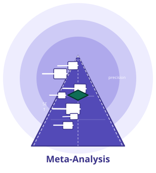

# meta-analysis 技能

[🇬🇧 English (英文)](./README.md) | [🇨🇳 中文 (当前)](#)

  

> **临床研究者友好的 R 语言 Meta 分析技能**
>
> 无需编程、无需记忆命令——在对话中用**自然语言**描述你的 Meta 分析需求，技能自动完成全套分析。底层基于 R 与 15+ 专业 R 包（metafor、meta、netmeta、gemtc 等），输出语言随操作系统语言自动切换（中文系统出中文，否则出英文；可随时强制切换）。默认采用**安全预览**模式——只展示生成的 R 代码、不执行；确认无误后说出触发词即可真正计算。

---

## 1. 对话中使用（核心）

meta-analysis 是**对话式技能**：用自然语言告诉助手你要做什么——无需命令、无需记忆参数名。作为 WorkBuddy 技能，**自动加载、无需额外安装**。

以下 6 个真实对话示例，从简单到高级排列。每个示例含 **「你说」** 和 **「助手回复（示意）」**，以及如何触发真实计算。

### 示例 1 · 两组二分类 Meta（最常见）
**你说：**
> 合并以下 5 项二分类研究的 OR：
> 研究A: 实验组 30/100, 对照组 20/100
> 研究B: 实验组 45/120, 对照组 30/120
> ...

**助手回复（示意）：**
> ✅ 5 项研究，随机效应模型 (DL)，OR = 1.52 (95%CI: 1.18–1.96), I² = 34%
> （安全预览：下方 R 代码已生成，未执行。）

**📌 获取真实结果：** 说 **「请直接计算」** —— 助手真正运行 R 并给出数字（详见第 4 节「安全预览」）。

### 示例 2 · 效应量转换
**你说：**
> 把 Cohen's d = 0.8 转成 logOR

**助手回复（示意）：**
> ✅ d = 0.8 → logOR ≈ 1.45 (SE ≈ 0.38)，基于公式 logOR = d × π/√3

### 示例 3 · 异质性 + 亚组
**你说：**
> 我做了 8 项研究的连续型 Meta，SMD 合并，但 I² 比较高，想按地区做亚组

**助手回复（示意）：**
> ✅ 8 项研究，SMD = 0.42 (95%CI: 0.15–0.69), I² = 78%
> 亚组分析（地区）：
> - 亚洲 (k=4): SMD = 0.55, I² = 45%
> - 欧美 (k=4): SMD = 0.28, I² = 62%
> - 组间 Q = 4.12, p = 0.04

### 示例 4 · Complex：网络 Meta 含多个决策（弹出路由菜单）
**你说：**
> 我想做个网络 Meta，有 4 种干预措施，但还没决定用频率学派还是贝叶斯，也不知道要不要做剂量反应

**助手回复（示意）：**
> 4 种干预已明确。还有 2 个关键选择，我来帮你理清：
>
> **① 你倾向哪种分析框架？**
> - (a) 频率学派 — `netmeta`，基于倒方差法，适合一致性网络
> - (b) 贝叶斯 — `multinma` (Stan) 或 `gemtc` (JAGS)，适合含生存数据 / 剂量反应
>
> **② 要不要纳入剂量反应？**
> - (a) 不做 — 纯两两比较网络
> - (b) 做 — 需要剂量-效应参数，贝叶斯框架更合适
>
> **③ 拿不准？** → 说「详细解释这些选择的差异」，我先讲清再让你决定

**📌 说明：** 当你已点名能力但卡在「哪个选项 / 设计族」时，助手**弹出路由菜单**逐步确认，而非替你拍板或甩全量菜单。菜单含「详细解释差异」入口——拿不准时先讲清再决定。

### 示例 5 · Vague：不确定用哪种模型（grill-me）
**你说：**
> 我想做个 Meta 分析，但不确定该用哪种模型，能帮我梳理一下吗？

**助手回复（示意）：**
> 好的，我们先把你的需求理清楚。每轮问 1–3 个聚焦问题，每个带推荐默认：
>
> **第 1 轮（3 题）：**
> 1. 你的结局类型是？— 二分类(OR/RR) / 连续型(SMD/MD) / 生存(HR) / 单组率 / 其他
> 2. 数据是两组比较还是多组网络？— 两组 / 多组网络 / 不确定
> 3. 有没有特殊的依赖结构？— 多臂研究 / 多结局 / 个体数据(IPD) / 都没有
>
> （回答后继续追问，直到锁定模型 — 不会甩全量菜单）

**📌 说明：** 当你说「不确定用哪种」时，助手用 **grill-me 逐分支追问** 理清需求，而非甩全量菜单或替你选。

### 示例 6 · 系统评价流程
**你说：**
> 帮我生成 PRISMA 流程图

**助手回复（示意）：**
> 请提供：
> - 检索记录数：___
> - 筛选记录数：___
> - 排除记录数：___
> - 全文评估数：___
> - 全文排除数（+排除原因）：___
> - 纳入研究数：___
>
> 用户：520, 380, 140, 80, 52(20 无数据, 18 人群不符, 14 设计不符), 28
>
> ✅ PRISMA 流程图已生成！[SVG 输出]

> 💡 **提示：** 大多数分析只需 3 项——效应量（或率/HR）+ α + 把握度。省略部分会用合理默认值填充；若确实缺少必要参数，助手会追问。

---

## 2. 能做什么——场景索引

按**分析目的**分组（7 大类）。每行给典型临床场景 + 可直接抄写的自然语言。同一分析可能从多个入口到达。

> 底层 R 包名（metafor / meta / netmeta …）见第 5 节「进阶参考」；普通用户无需关心。

### ① 两组 Meta 分析
| 场景 | 试试这样说 |
|:---|:---|
| 二分类 (OR/RR/RD) | "合并这 5 项二分类研究的 OR" |
| 连续型 (SMD/MD) | "合并 6 项连续型研究的 SMD" |
| 预计算 (yi+CI) | "我有 5 个研究的效应量和 CI，直接画森林图" |
| 生存 (HR) | "合并 8 项研究的 HR" |
| 相关 (r→Zr) | "把这 4 个相关系数做 Fisher z 转换后合并" |
| 单组率/均值 | "合并这几个研究的发病率" |
| 通用逆方差 | "我有 yi 和 vi，直接做 Meta" |

### ② 异质性与发表偏倚
| 场景 | 试试这样说 |
|:---|:---|
| 异质性评估 | "我做了 Meta，I² 很高，帮我看下异质性" |
| 亚组分析 | "按地区做亚组分析" |
| 元回归 | "做元回归，看发表年份和样本量的影响" |
| Egger 检验 | "检查发表偏倚，做 Egger 检验" |
| Begg 检验 | "Begg 秩相关检验" |
| 剪补法 | "用剪补法校正发表偏倚" |
| 选择模型 | "用 selection model 评估发表偏倚" |
| 敏感性分析 | "做 leave-one-out 敏感性分析" |
| 累积 Meta | "按发表年份做累积 Meta" |
| GOSH 图 | "画 GOSH 图看异质性模式" |
| Baujat 诊断 | "做 Baujat 图，看哪个研究贡献最大异质性" |
| Drapery 图 | "画 Drapery 图评估 α 稳健性" |

### ③ 高级模型
| 场景 | 试试这样说 |
|:---|:---|
| 频率学派 NMA | "做网络 Meta，4 种干预，用 netmeta" |
| 贝叶斯 NMA (Stan) | "做贝叶斯网络 Meta，Stan 后端" |
| 贝叶斯 NMA (JAGS) | "做贝叶斯网络 Meta，JAGS 后端" |
| 多水平 Meta | "做 3 水平 Meta，研究内多个效应" |
| 多变量 Meta | "合并多个相关结局的 Meta" |
| IPD Meta | "我有患者个体数据，做 IPD Meta" |
| 剂量反应 | "做剂量反应 Meta，dosresmeta" |
| 生存 Meta | "合并生存数据，survmeta" |
| 试验序贯分析 | "做 TSA，看还需要多少研究" |
| Bootstrap Meta | "用 Bootstrap 做非参数 DL 估计" |

### ④ 效应量与转换
| 场景 | 试试这样说 |
|:---|:---|
| 均值/SD→d | "把均值标准差转成 Cohen's d" |
| t/F→d | "把 t 值转成 d" |
| r→Fisher z | "把相关系数转成 Fisher z" |
| d↔logOR | "把 d 转成 logOR" |
| OR↔logOR | "把 OR 转成 logOR" |
| 批量转换 | "批量把 SMD 转成 logOR" |
| NNT | "计算 NNT" |

### ⑤ 可视化
| 场景 | 试试这样说 |
|:---|:---|
| 森林图 | "画森林图，lancet 主题" |
| 漏斗图 | "画漏斗图，带轮廓增强" |
| 气泡图 | "画元回归气泡图" |
| GOSH 图 | "画 GOSH 图" |
| 网络图 | "画网络 Meta 的网络图" |
| 联赛表 | "画 NMA 联赛表" |
| RoB 交通灯图 | "画偏倚风险交通灯图" |
| 功效曲线 | "画功效曲线" |
| Drapery 图 | "画 Drapery 图" |
| 不一致性热图 | "画 NMA 不一致性热图" |

### ⑥ 研究质量
| 场景 | 试试这样说 |
|:---|:---|
| RoB 2.0 | "用 RoB 2.0 评估偏倚风险" |
| RoB 1.0 | "用 Cochrane RoB 1.0 评估" |
| ROBINS-I | "非随机研究，用 ROBINS-I" |
| GRADE | "做 GRADE 证据质量评价" |
| PRISMA 检查表 | "PRISMA 检查表" |

### ⑦ 系统评价流程
| 场景 | 试试这样说 |
|:---|:---|
| PRISMA 流程图 | "帮我生成 PRISMA 流程图" |
| 文献筛选 | "标题摘要筛选，AI 辅助" |
| PDF 批量下载 | "从 DOI 列表批量下载全文（需确认）" |
| 图形数字化 | "从散点图提取数据" |
| 缺失值插补 | "缺失标准差的插补" |

> ⚠️ **PDF 批量下载**会访问外部网络并在本地磁盘写入文件。仅在用户明确要求时运行，并遵守版权与访问限制。

---

## 3. 首次使用 FAQ

**Q: 我只给了效应量和研究数量，其他参数没给——能算吗？**
A: 可以。大多数分析只需 3 项——效应量（或率/HR）+ α + 把握度。省略部分（双侧 α=0.05、1:1 随机、随访）会用合理默认值填充；若确实缺少必要参数，助手会追问。

**Q: 结果里的 n 是每组还是总样本量？**
A: 默认是**每组**；配对/交叉设计报告每序列，生存分析常报告所需总事件数。输出会明确标注，不会混淆。

**Q: 只显示了代码，没出数字，怎么拿到真结果？**
A: 在对话中说 **"请直接计算"** 或 **"执行"** —— 助手会真正运行 R 并给出数字。这是默认的安全设计：先看代码，确认无误再计算。**执行只发生在你明确说出这句高摩擦指令时**——技能不会自行运行 R，也不会因闲聊中偶然提到这些词就触发。

**Q: 想要可复现的 R 代码用于投稿或稽查，怎么要？**
A: 说 **"给我完整 R 代码"**。安全预览模式默认就展示代码，你可以自行复制、修改、重跑。

**Q: 中文系统下输出是中文吗？**
A: 是的。默认输出语言随 OS 语言设定——中文系统出中文，否则出英文。此默认行为仅影响显示语言、无需额外授权；可随时通过提示词强制切换（如「用中文回复」/「switch to English」）。

**Q: 数据格式不对怎么办？**
A: 说 **"帮我把 SPSS/Excel 数据转成 CSV"**，助手会推荐安装 `@skill:statdata-transfer` 做 50+ 格式转换。

---

## 4. 安全预览（Safe Preview）

- **默认行为：** 技能只**生成并展示 R 代码、不执行**——你可以先审查逻辑，确认无误后再让它运行。
- **触发真实计算：** 在对话中说 **"请直接计算"** 或 **"执行"** → 助手真正运行 R 并给出数字。
- **只看代码：** 说 **"展示代码"** 或 **"仅预览"** → 只给代码不给结果。
- **所有计算均在本地**——不上传任何用户数据。
- **输出结果仅供参考**，投稿或申报前请结合专业背景复核。

---

## 5. 进阶参考（已迁移到独立文件）

CLI 调用示例、双向求解模式、曲线模式、核心公式推导、系统/环境要求、常见错误排查、完整文件结构树、参考文献等开发者内容已迁移至 **[references/ADVANCED_zh-CN.md](references/ADVANCED_zh-CN.md)**。普通用户无需阅读，第 1–4 节已覆盖日常使用。

---

**版本**: v1.8.3 | **许可**: MIT | **作者**: medstatstar, phoe-zip

如有功能改进建议、Bug 报告或其他反馈，请直接联系作者：medstatstar@gmail.com（张文彤 / Wintone Zhang）。

